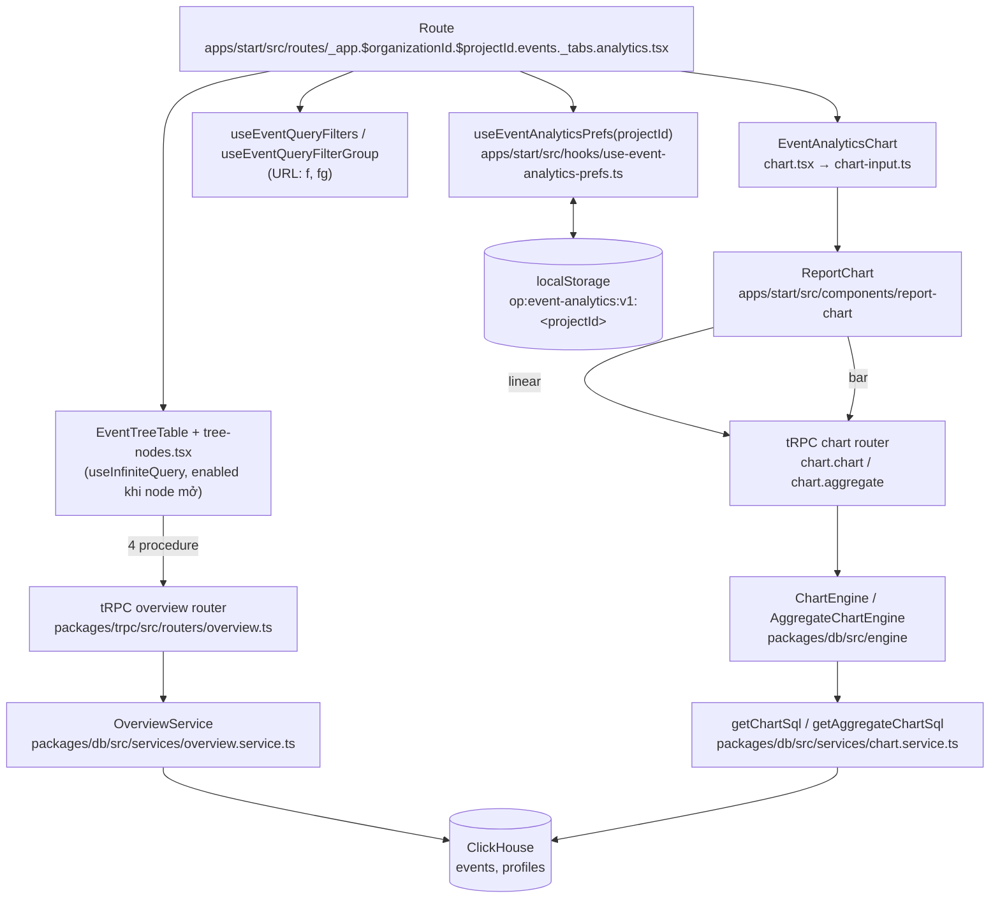

# Event Analytics — Kiến trúc và use case

Nhánh: `feature/event-analytics` @ `69dc1f4d`
Biên bản nghiệm thu đi kèm: [`ACCEPTANCE.md`](./ACCEPTANCE.md)

> **Mọi đoạn SQL trong tài liệu này là output thật.** Chúng được lấy ngày 2026-09-17 bằng cách gọi đúng builder rồi `.toSQL()` (hoặc `await getChartSql(...)`) với tham số ghi ở từng ca, không chép tay. Khi code đổi, chạy lại để cập nhật, đừng sửa SQL bằng tay. Project id `demo`, khoảng thời gian `2026-09-01 00:00:00` → `2026-09-07 23:59:59`, timezone `UTC`.

## 1. Luồng tổng thể



Hai nhánh cùng đọc **một tập event đã lọc**:

- **Bảng**: route → `EventTreeTable` → 4 procedure `overview.*` → `OverviewService` → builder SQL → ClickHouse. Router lấy timezone bằng `getSettingsForProject` và quy đổi khoảng thời gian bằng `getCurrentAndPrevious`, rồi gọi `overviewService.getEventAnalyticsList` / `getEventAnalyticsTotals` / `getEventPropertyKeys` / `getEventPropertyValues`.
- **Chart**: route → `EventAnalyticsChart` (`chart.tsx`) → `buildEventAnalyticsChartInput` (`chart-input.ts`) → `ReportChart` → `trpc.chart.chart` (line) hoặc `trpc.chart.aggregate` (bar) → `ChartEngine.execute` / `AggregateChartEngine.execute` (`packages/db/src/engine/index.ts`) → `normalize` → `plan` → `fetch` → `getChartSql` / `getAggregateChartSql`.

Bảng là **nguồn chân lý**. Chart phải lọc ra đúng tập event như bảng (mục 4, bất biến I3).

## 2. Contract

Tất cả nằm ở `packages/validation/src/event-analytics.ts`.

### 2.1 Bốn endpoint

Mọi input kế thừa `zEventAnalyticsRange`:

```ts
{
  projectId: string;
  range: IChartRange;
  startDate?: string | null;
  endDate?: string | null;
  filters: IChartEventFilter[];
  filterGroup?: IFilterGroup;          // thắng `filters` khi có mặt
  metrics?: IEventAnalyticsMetric[];   // vắng = chỉ events + users
}
```

| Procedure | Input thêm | Output |
|---|---|---|
| `overview.eventAnalyticsList` | `search?`, `sort`, `dir`, `cursor?`, `limit` (mặc định 10) | `{ rows: (IEventAnalyticsMetricRow & { name })[]; nextCursor: number \| null }` |
| `overview.eventAnalyticsTotals` | — | `IEventAnalyticsMetricRow`, **khử trùng lặp** trên toàn bộ event |
| `overview.eventPropertyKeys` | `event`, `prefix` (`''` hoặc `'payload.'`), `parentPath`, `cursor?`, `limit` (mặc định 20) | `{ rows: (IEventAnalyticsMetricRow & { key; kind: 'key' \| 'obj'; type: 'num' \| 'str' \| 'unknown' })[]; nextCursor }` |
| `overview.eventPropertyValues` | `event`, `key`, `type`, `parentPath`, `sort`, `dir`, `cursor?`, `limit` (mặc định 5) | `{ rows: (IEventAnalyticsMetricRow & { value })[]; remaining: number; nextCursor }` |

```ts
type IEventAnalyticsMetricRow = {
  events: number;                     // luôn có
  users: number;                      // luôn có
  metrics?: Record<string, number>;   // theo metricKey, chỉ các metric được yêu cầu
};
```

`sort` là string. `refineSort` chỉ chấp nhận `events` / `users` / `epu` hoặc một `metricKey` có trong `metrics` của chính request đó. Chuỗi bất kỳ bị từ chối ngay ở API.

> Router còn procedure cũ `overview.eventAnalytics` (bảng phẳng trước T4). Không component nào gọi nữa — backlog K3 trong `ACCEPTANCE.md`.

### 2.2 Ngữ pháp độ sâu

Tầng đếm từ event: **key = 1, value = 2, nested key = 3, value của nested key = 4** (`EVENT_ANALYTICS_MAX_DEPTH = 4`).

`parentPath` là danh sách cặp `key = value` của các tổ tiên. Node đang được query chiếm một tầng riêng, nên `parentPath` **tối đa 1 phần tử** (`EVENT_ANALYTICS_MAX_PARENT_PATH = 1`):

| Query | `parentPath` | Trả về tầng |
|---|---|---|
| `eventPropertyKeys` | `[]` | 1 |
| `eventPropertyValues` | `[]` | 2 |
| `eventPropertyKeys` | `[{ key, value }]` | 3 |
| `eventPropertyValues` | `[{ key, value }]` | 4 |

Server chặn thêm lần nữa bằng `assertEventPropertyDepth` trong `overview.service.ts`.

### 2.3 Metric catalogue

`EVENT_ANALYTICS_METRICS` — 11 metric. Thứ tự khai báo là thứ tự trong picker.

| id | Label | Nhóm | Param | Additive | Locked |
|---|---|---|---|---|---|
| `events` | Events | events | — | ✓ | ✓ |
| `uniq_param` | Unique parameter values | events | ✓ | — | — |
| `sum_param` | Sum of parameter values | events | ✓ | ✓ | — |
| `avg_param` | Average parameter value | events | ✓ | — | — |
| `median_param` | Median value of the parameter | events | ✓ | — | — |
| `users` | Users | users | — | — | — |
| `epu` | Events per user | users | — | — | — |
| `epau` | Events per app user | users | — | — | — |
| `pctu` | % of all users | users | — | — | — |
| `uniq_param_user` | Unique parameter values per user | users | ✓ | — | — |
| `sum_param_user` | Sum of parameter values per user | users | ✓ | — | — |

- `metricKey(metric)` trả `id`, hoặc `id:param` cho metric có parameter. `sum_param` trên `coins` là `sum_param:coins`. Cùng một metric trên hai parameter là hai cột khác nhau.
- **Additive** nghĩa là giá trị nút cha bằng tổng các nút con. Chỉ `events` và `sum_param` là additive. Các cột khác **không bao giờ** được cộng từ nhánh (bất biến I2).
- `superRefine` trên mảng `metrics`: metric có parameter phải có `param` không rỗng, metric thường không được có `param`, không trùng key, bắt buộc có `events`, tối đa `EVENT_ANALYTICS_MAX_METRICS = 10`.

### 2.4 Preferences

| | |
|---|---|
| Schema | `zEventAnalyticsPreferences` (`packages/validation/src/event-analytics.ts`) |
| Key localStorage | `eventAnalyticsPrefsKey(projectId)` → `op:event-analytics:v1:<projectId>` |
| Hook | `useEventAnalyticsPrefs` (`apps/start/src/hooks/use-event-analytics-prefs.ts`), đọc qua `readEventAnalyticsPrefs`, ghi qua `writeEventAnalyticsPrefs` debounce `WRITE_DEBOUNCE_MS = 300` |
| Mặc định | `DEFAULT_EVENT_ANALYTICS_PREFS`: metrics `events, users, epu, pctu`; sort `events desc`; `pct: true`; chart `events / day / linear / không thu gọn`; `selected: []` |

```ts
{
  version: 1,
  metrics: IEventAnalyticsMetric[],
  sort: { key: string; dir: 'asc' | 'desc' },
  pct: boolean,
  chart: { metric: string; granularity: string; type: string; collapsed: boolean },
  selected: string[],   // mảng rỗng là lựa chọn có chủ đích
}
```

- **Không lưu**: filter và filter group (nằm trên URL `f` / `fg` để chia sẻ link được), khoảng thời gian, chuỗi search, trạng thái expanded của cây (khôi phục sẽ bắn hàng loạt child query lúc load).
- Entry không qua được schema thì **vứt cả entry**, không khôi phục một phần.
- Hook trả `status: 'loading' | 'stored' | 'absent'`. Cold start của chart (`coldStartSelection` trong `chart-cold-start.ts`) chỉ áp dụng khi `absent`. Người dùng cố ý bỏ chọn hết rồi reload thì không tự chọn lại.

## 3. Use case và SQL thật

### 3a. Liệt kê event

**Ai gọi:** `EventTreeTable` → `overview.eventAnalyticsList` + `overview.eventAnalyticsTotals`
**Builder:** `buildEventAnalyticsListQuery`, `buildEventAnalyticsTotalsQuery`. Cả hai dựng trên `buildEventAnalyticsBaseQuery`, nên dòng và tổng không thể lệch nhau.

List, tham số `search: 'level_%'`, `sort: 'events'`, `dir: 'desc'`, `limit: 10`, `cursor: 20`:

```sql
SELECT name, count() AS events, uniqExact(profile_id) AS users FROM events WHERE project_id = 'demo' AND created_at BETWEEN toDateTime('2026-09-01 00:00:00') AND toDateTime('2026-09-07 23:59:59') AND name ILIKE '%level\\_\\%%' GROUP BY name ORDER BY events DESC, name ASC LIMIT 11 OFFSET 20
```

Totals:

```sql
SELECT count() AS events, uniqExact(profile_id) AS users FROM events WHERE project_id = 'demo' AND created_at BETWEEN toDateTime('2026-09-01 00:00:00') AND toDateTime('2026-09-07 23:59:59')
```

Điểm ngữ nghĩa:
- **`LIMIT limit + 1`**: dòng thừa cho biết còn trang sau. Service cắt về `limit` và trả `nextCursor = cursor + limit`.
- **Search là chuỗi literal**: `escapeLikeTerm` escape `\`, `%`, `_` (`LIKE_WILDCARD_RE = /[\\%_]/g`). `level_%` chỉ khớp tên có đúng chuỗi `level_%`, không phải mọi tên bắt đầu bằng `level`.
- **Tie-break `name ASC`** giữ thứ tự ổn định giữa các trang khi nhiều dòng bằng giá trị sort.
- **Totals là query riêng**, `uniqExact(profile_id)` trên toàn lát event. Một user bắn hai event được đếm một lần ở tổng và hai lần trong cây. Tổng users **nhỏ hơn** tổng users các nhánh, và đó là đúng.

### 3b. Mở property keys

**Ai gọi:** node event hoặc node value trong `tree-nodes.tsx` → `overview.eventPropertyKeys`
**Builder:** `buildEventPropertyKeysQuery`

Tầng 1, `event: 'level_start'`, `prefix: ''`, `parentPath: []`, `limit: 20`:

```sql
WITH base_events AS (SELECT profile_id, properties FROM events WHERE project_id = 'demo' AND created_at BETWEEN toDateTime('2026-09-01 00:00:00') AND toDateTime('2026-09-07 23:59:59') AND name = 'level_start'), matched_keys AS (SELECT profile_id, properties, arrayFilter(k -> startsWith(k, ''), mapKeys(properties)) AS matched FROM base_events), segments AS (SELECT profile_id, properties, matched, arrayJoin(arrayDistinct(arrayMap(k -> splitByChar('.', substring(k, length('') + 1))[1], matched))) AS segment FROM matched_keys WHERE notEmpty(matched)) SELECT segment AS key, count() AS events, uniqExact(profile_id) AS users, max(arrayExists(k -> startsWith(k, concat('', segment, '.')), matched)) AS has_nested, countIf(properties[concat('', segment)] != '' AND toFloat64OrNull(properties[concat('', segment)]) IS NULL) AS non_numeric FROM segments GROUP BY segment ORDER BY events DESC, key ASC LIMIT 21 OFFSET 0
```

Tầng 3, `prefix: 'payload.'`, `parentPath: [{ key: 'level_mode', value: 'hard' }]`:

```sql
WITH base_events AS (SELECT profile_id, properties FROM events WHERE project_id = 'demo' AND created_at BETWEEN toDateTime('2026-09-01 00:00:00') AND toDateTime('2026-09-07 23:59:59') AND name = 'level_start' AND properties['level_mode'] = 'hard'), matched_keys AS (SELECT profile_id, properties, arrayFilter(k -> startsWith(k, 'payload.'), mapKeys(properties)) AS matched FROM base_events), segments AS (SELECT profile_id, properties, matched, arrayJoin(arrayDistinct(arrayMap(k -> splitByChar('.', substring(k, length('payload.') + 1))[1], matched))) AS segment FROM matched_keys WHERE notEmpty(matched)) SELECT segment AS key, count() AS events, uniqExact(profile_id) AS users, max(arrayExists(k -> startsWith(k, concat('payload.', segment, '.')), matched)) AS has_nested, countIf(properties[concat('payload.', segment)] != '' AND toFloat64OrNull(properties[concat('payload.', segment)]) IS NULL) AS non_numeric FROM segments GROUP BY segment ORDER BY events DESC, key ASC LIMIT 21 OFFSET 0
```

Điểm ngữ nghĩa:
- **Cây dựng từ key phẳng.** `properties` là `Map(String, String)` đã được `toDots` làm phẳng lúc ingest. `splitByChar('.', …)[1]` lấy segment kế tiếp sau `prefix`.
- **`arrayDistinct` trước `arrayJoin`**: một event có `payload.a.x` và `payload.a.y` sinh segment `a` **một lần**. Nhờ vậy `count()` đếm event, không đếm key con.
- **`kind: 'obj'`** khi `has_nested > 0`, tức có key dài hơn bắt đầu bằng `segment.`.
- **PA1 — kiểu suy luận lúc đọc**: key lá là `num` khi `non_numeric = 0`, tức mọi giá trị **không rỗng** parse được số. Key `obj` luôn `unknown`. Key mà mọi giá trị rỗng ra `num` — có chủ đích (L4 trong `ACCEPTANCE.md`).
- `parentPath` thành `properties['level_mode'] = 'hard'` trong `base_events`.

### 3c. Mở values

**Ai gọi:** node key trong `tree-nodes.tsx` → `overview.eventPropertyValues`
**Builder:** `buildEventPropertyValuesQuery`

`event: 'level_start'`, `key: 'level_id'`, `type: 'num'`, `parentPath: []`, `sort: 'events'`, `dir: 'desc'`, `limit: 5`:

```sql
WITH base_values AS (SELECT properties, profile_id FROM events WHERE project_id = 'demo' AND created_at BETWEEN toDateTime('2026-09-01 00:00:00') AND toDateTime('2026-09-07 23:59:59') AND name = 'level_start' AND mapContains(properties, 'level_id')), value_totals AS (SELECT uniqExact(properties['level_id']) AS total_distinct FROM base_values) SELECT properties['level_id'] AS value, count() AS events, uniqExact(profile_id) AS users, total_distinct FROM base_values CROSS JOIN value_totals  GROUP BY value, total_distinct ORDER BY events DESC, toFloat64OrNull(value) ASC LIMIT 6 OFFSET 0
```

Điểm ngữ nghĩa:
- **`mapContains(properties, 'level_id')`** giới hạn vào event thực sự mang key. Ở đây dùng được vì là map của bảng `events`. Quy tắc cấm `mapContains` (mục 4, I5) chỉ áp cho `profile.properties`.
- **Tie-break theo kiểu**: `num` sắp `toFloat64OrNull(value) ASC` (`10` sau `9`), `str` sắp theo chuỗi.
- **`remaining` và `nextCursor` suy từ cùng một cờ `hasMore`** (dòng thứ `limit + 1` có tồn tại hay không), trong `OverviewService.getEventPropertyValues`:
  - hết trang → `remaining: 0`, `nextCursor: null`;
  - còn trang → `remaining = Math.max(1, total_distinct - (cursor + rows.length))`, `nextCursor = cursor + rows.length`.

  Suy từ cùng một cờ có chủ đích: có `remaining` mà không có cursor thì nút "Load more" hiện ra nhưng bấm không được. `Math.max(1, …)` giữ nhãn không bao giờ ghi "0 còn lại" khi thực tế vẫn còn trang. `total_distinct` dùng `uniqExact`, không `uniq`, để số "còn lại" không trôi giữa các lần load.

### 3d. Metrics

**Ai gọi:** cả 4 endpoint khi request có `metrics`
**Hàm:** `eventAnalyticsMetricSelects` (sinh cột), `eventAnalyticsSortColumn` (sort), `toEventAnalyticsMetrics` (đổi dòng SQL thành map `metrics`) — đều trong `overview.service.ts`

List với cả 11 metric, sort `sum_param:coins`:

```sql
SELECT name, count() AS events, uniqExact(profile_id) AS users, uniqExact(coalesce(toFloat64OrNull(properties['day']), 0)) AS metric_5, sum(coalesce(toFloat64OrNull(properties['coins']), 0)) AS metric_6, sum(coalesce(toFloat64OrNull(properties['coins']), 0)) / count() AS metric_7, quantileExact(0.5)(coalesce(toFloat64OrNull(properties['coins']), 0)) AS metric_8, uniqExact(coalesce(toFloat64OrNull(properties['day']), 0)) / uniqExact(profile_id) AS metric_9, sum(coalesce(toFloat64OrNull(properties['coins']), 0)) / uniqExact(profile_id) AS metric_10 FROM events WHERE project_id = 'demo' AND created_at BETWEEN toDateTime('2026-09-01 00:00:00') AND toDateTime('2026-09-07 23:59:59') GROUP BY name ORDER BY metric_6 DESC, name ASC LIMIT 11 OFFSET 0
```

Thứ tự `metrics` trong request là `events, users, epu, pctu, epau, uniq_param:day, sum_param:coins, avg_param:coins, median_param:coins, uniq_param_user:day, sum_param_user:coins`.

Cùng request, `sort: 'pctu'` → `ORDER BY users DESC, name ASC`. `sort: 'epau'` → `ORDER BY events DESC, name ASC`.

| Metric | Biểu thức | Ghi chú |
|---|---|---|
| `events` | `count()` | luôn được select |
| `users` | `uniqExact(profile_id)` | luôn được select |
| `uniq_param` | `uniqExact(coalesce(toFloat64OrNull(properties['p']), 0))` | thiếu → góp giá trị `0` vào tập distinct |
| `sum_param` | `sum(coalesce(toFloat64OrNull(properties['p']), 0))` | |
| `avg_param` | `sum(coalesce(…, 0)) / count()` | chia cho **mọi** event của node, không dùng `avg` |
| `median_param` | `quantileExact(0.5)(coalesce(…, 0))` | tập giá trị gồm cả các số 0 |
| `uniq_param_user` | `uniqExact(coalesce(…, 0)) / uniqExact(profile_id)` | |
| `sum_param_user` | `sum(coalesce(…, 0)) / uniqExact(profile_id)` | |
| `epu` | *(không emit)* | renderer: `events / users` của chính dòng |
| `pctu` | *(không emit)* | renderer: `users / totals.users` |
| `epau` | *(không emit)* | renderer: `events / totals.users` |

Điểm ngữ nghĩa:
- **Alias `metric_<i>`** (`eventAnalyticsMetricAlias(index)`), với `i` là **vị trí trong mảng `metrics` của request**. Vì `events, users, epu, pctu, epau` không emit cột, alias bắt đầu từ `metric_5` trong ví dụ trên. `toEventAnalyticsMetrics` đọc lại theo cùng chỉ số và trả map có key là `metricKey`.
- **Missing = 0** theo định nghĩa AppMetrica (spec Phase 2 Appendix A): *"A missing value or parameter in the event during the calculation is interpreted as 0"*. Viết `coalesce(toFloat64OrNull(x), 0)` chứ không `toFloat64OrZero(x)`, để grep `toFloat64OrZero` trong code vẫn ra rỗng (T6 đã xoá nó khỏi đường filter).
- **Vì sao `epu`, `pctu`, `epau` không emit SQL**: `epu` suy ra từ `events` và `users` đã có. Mẫu số của `pctu` và `epau` là `totals.users` — số liệu **cấp query**, đến từ endpoint totals chứ không từ `GROUP BY` theo node. Tính trong `GROUP BY` sẽ nhận lại users của chính node và vô tình tái tạo `epu`.
- **Sort `pctu` → `users`, `epau` → `events`**: mẫu số là hằng trong một query, nên thứ tự sort trùng thứ tự của tử số. Cột rẻ hơn thắng, không đưa phép chia vào `ORDER BY`.
- **`uniq_param` đếm trên giá trị đã ép số.** Mọi giá trị không parse được số (ví dụ `app_version = '1.2.3'`) và mọi event thiếu parameter đều thành cùng một giá trị `0`. Một parameter thuần chuỗi vì thế luôn cho `uniq_param = 1` nếu có ít nhất một event. Đây là hệ quả trực tiếp của quyết định missing = 0 (spec Phase 2 §5, A11), không phải bug. Nếu cần đếm chuỗi thô thì đổi một biểu thức: `uniqExactIf(properties['p'], properties['p'] != '')`.
- **`quantileExact`**, không `quantile`: median xấp xỉ sẽ đổi giữa hai lần load trên cùng dữ liệu. Ceiling: giữ mọi giá trị của group trong bộ nhớ. Đường thoát là đổi sang `quantile`.

### 3e. Filter

**Hàm dùng chung:** `compileEventAnalyticsFilter` (`chart.service.ts`) — cả bảng lẫn chart gọi hàm này
**Bảng:** `OverviewService.getEventAnalyticsWhereClause(filters, projectId, filterGroup?)`
**Walker:** `compileFilterGroup` / `getFilterGroupWhere` (`packages/db/src/services/filter-group.service.ts`)
**Schema group:** `zFilterGroup` (`packages/validation/src/filter-group.ts`)

#### Đường phẳng

`filters = [properties.level_mode is hard, utm_source is newsletter, properties.level lt 1]`:

```sql
properties['level_mode'] = 'hard' AND properties['__query.utm_source'] = 'newsletter' AND (mapContains(properties, 'level') AND (toFloat64OrNull(properties['level']) < toFloat64('1')))
```

- `utm_*` không phải cột của `events`. `UTM_COLUMNS` đổi tên thành `properties.__query.utm_*`.
- **R10 / T6**: so sánh số dùng `toFloat64OrNull` kèm `mapContains`. Event thiếu `level` **không** thoả `level < 1`.

#### Đường filter group

Root `OR`: `profile.properties.plan missingProperty` | `properties.level_id hasProperty` | sub-group `AND` (`country is SE`, `profile.email is a@b.c`):

```sql
((profile_id IN (SELECT id FROM profiles AS profile FINAL WHERE project_id = 'demo' AND profile.properties['plan'] = '')) OR (properties['level_id'] != '') OR (((country = 'SE') AND (profile_id IN (SELECT id FROM profiles AS profile FINAL WHERE project_id = 'demo' AND profile.email = 'a@b.c')))))
```

- **Hai cấp bằng hình dạng schema**: `zFilterSubGroup.children` chỉ nhận condition. Payload 3 cấp bị zod từ chối, không cần đếm độ sâu lúc chạy.
- **Walker**: mỗi fragment và cả danh sách đều được bọc ngoặc. Condition compile ra `null` bị **bỏ**; group rỗng trả `null` (không lọc), không bao giờ `1 = 0`. Bỏ một nhánh trong `OR` sẽ **nới rộng** kết quả, vì vậy UI khoá nút Apply khi có condition thiếu giá trị.
- **Presence**: `hasProperty` → `map['k'] != ''`, `missingProperty` → `map['k'] = ''`. Chuỗi rỗng tính là thiếu, vì ClickHouse `Map(String, String)` trả `''` cho key không có.
- Không có `filterGroup` → đường phẳng, **byte-identical** với trước khi có group.

#### Profile qua subselect, không qua CTE join

`profile.*` luôn thành `profile_id IN (SELECT id FROM profiles AS profile FINAL WHERE project_id = … AND <clause>)`.

Không dùng CTE join như report chart vì **hai cách cho kết quả khác nhau** — đã đo trên ClickHouse (`chart-filter-group-parity.test.ts`). Với event có `profile_id` nhưng **không có dòng** trong `profiles`:

| Đường | `profile.properties.plan missingProperty` |
|---|---|
| `LEFT ANY JOIN` profile CTE | cột profile đọc ra `''` → **thoả** |
| Subselect `profiles FINAL` | không có id trong tập → **không thoả** |

Trên fixture parity: bảng đếm **1** event, chart đi đường join phẳng đếm **2**. Subselect cũng tránh được bẫy §5.4 của spec advanced filters: không có cột CTE bị thu hẹp nào để trỏ nhầm.

#### Ngữ pháp wildcard — `transformPropertyKey`

Wildcard biến key thành pattern `LIKE` trên key của map (bỏ tiền tố `properties.` / `profile.properties.`), và phép so sánh chuyển sang dạng `arrayExists`:

| Dạng | Key | Pattern |
|---|---|---|
| Cuối | `properties.items.*` | `items.%` |
| Giữa | `properties.items.*.sku` | `items.%.sku` |
| Mảng | `properties.tags[*]` | `tags.%` |
| Nhiều / kề nhau | `a.*.b.*.c`, `a.*[*].c` | `a.%.b.%.c`, `a.%.%.c` |

`properties.items.*.sku is x`:

```sql
arrayExists(x -> x = 'x', arrayMap(x -> trim(x), mapValues(mapExtractKeyLike(properties, 'items.%.sku'))))
```

`profile.properties.items.*.name is x` (map profile, trong subselect):

```sql
profile_id IN (SELECT id FROM profiles AS profile FINAL WHERE project_id = 'demo' AND arrayExists(x -> x = 'x', arrayMap(x -> trim(x), mapValues(mapExtractKeyLike(profile.properties, 'items.%.name')))))
```

> **Lỗi đã biết — wildcard ở đầu.** `properties.*.sku is x` sinh ra:
>
> ```sql
> arrayMap(x -> trim(x), mapValues(mapExtractKeyLike(properties, '*.sku'))) = 'x'
> ```
>
> Chạy trên ClickHouse 26.1: `Code: 130 … while converting 'x' to Array(String)`. Regex `/\.\*(?=\.|$)/g` cần dấu chấm **đứng trước** `*`, nên `*` ở đầu không thành `%`. Sau đó `isWildcard = propertyKey.includes('%')` ra false và clause rơi vào nhánh so sánh vô hướng. UI hiện không sinh dạng này. Backlog K2 trong `ACCEPTANCE.md`.

### 3f. Chart

**Ai gọi:** `EventAnalyticsChart` (`chart.tsx`)
**Hàm:** `buildEventAnalyticsChartInput`, `chartSegmentFor`, `resolveChartMetric` (`chart-input.ts`); engine `toChartQueryEvent` (`packages/db/src/engine/fetch.ts`)

#### Metric → segment

| Metric | Segment |
|---|---|
| `events` | `event` |
| `users` | `user` |
| `epu` | `user_average` |
| `sum_param` | `property_sum_missing_zero` |
| `avg_param` | `property_average_missing_zero` |
| `median_param` | `property_median_missing_zero` |
| `uniq_param` | `property_unique_missing_zero` |
| `sum_param_user` | `property_sum_per_user_missing_zero` |
| `uniq_param_user` | `property_unique_per_user_missing_zero` |
| `epau`, `pctu` | *(không có — `· not in chart: needs all users per interval`)* |

Chart vẽ được 9/11 metric. Chart **phải** dùng các segment `*_missing_zero`, không dùng `property_*` cũ: segment cũ bỏ qua event thiếu parameter, trong khi bảng tính thiếu = 0 (`property_average` sẽ vẽ 4.5 ở chỗ bảng ghi 2.25).

#### Series theo thời gian, cùng filter group với bảng

`getChartSql`, segment `property_sum_missing_zero`, `property: 'properties.coins'`, `filterGroup` là group ở 3e:

```sql
SELECT * EXCEPT (_uc_state), uniqMerge(_uc_state) OVER () as total_count FROM (SELECT 'level_start' as label_0, sum(coalesce(toFloat64OrNull(e.properties['coins']), 0)) as count, toStartOfDay(created_at) as date, uniqState(profile_id) as _uc_state FROM events e  WHERE (((profile_id IN (SELECT id FROM profiles AS profile FINAL WHERE project_id = 'demo' AND profile.properties['plan'] = '')) OR (e.properties['level_id'] != '') OR (((country = 'SE') AND (profile_id IN (SELECT id FROM profiles AS profile FINAL WHERE project_id = 'demo' AND profile.email = 'a@b.c')))))) AND (project_id = 'demo') AND (e.name = 'level_start') AND (created_at >= toDateTime('2026-09-01 00:00:00')) AND (created_at <= toDateTime('2026-09-07 23:59:59')) GROUP BY date) ORDER BY date ASC WITH FILL FROM toStartOfDay(toDateTime('2026-09-01 00:00:00')) TO toStartOfDay(toDateTime('2026-09-07 23:59:59')) STEP toIntervalDay(1)
```

- **Parity với bảng**: mệnh đề lọc giống hệt đoạn SQL của bảng ở 3e, chỉ thêm alias `e.` cho cột của `events` (chart join thêm bảng khác cũng có cột `properties`).
- **Chart Event Analytics luôn gửi group**, kể cả khi chỉ có filter phẳng: `resolveFilterGroup(filters, filterGroup)`. Đường phẳng của chart đi qua CTE join và lệch bảng như đã nêu ở 3e.
- Engine dựng query qua `toChartQueryEvent`. Trước B7, engine liệt kê field bằng tay và làm rớt `filterGroup`.

#### Tổng một bucket

`getAggregateChartSql` (chart dạng bar), segment `property_average_missing_zero`:

```sql
SELECT 'level_start' as label_0, '2026-09-01 00:00:00' as date, sum(coalesce(toFloat64OrNull(e.properties['coins']), 0)) / count() as count FROM events e WHERE (project_id = 'demo') AND (e.name = 'level_start') AND (created_at >= toDateTime('2026-09-01 00:00:00')) AND (created_at <= toDateTime('2026-09-07 23:59:59')) GROUP BY label_0 ORDER BY count DESC
```

- **Một bucket cho mỗi serie**, phủ cả khoảng thời gian: `GROUP BY label_0`, không group theo interval, `date` là hằng.
- `format.ts` tính tổng của serie bằng cách **cộng các bucket**. Cách đó chỉ đúng với metric additive. Với `epu`, average, ratio per-user, tổng vẫn đúng **chỉ vì** chỉ có một bucket. `event-analytics-aggregate-bucket.test.ts` ghim bất biến này: nếu query aggregate bắt đầu group theo interval, test đỏ trước khi tổng âm thầm thành tổng các tỷ số.

## 4. Quy tắc ngữ nghĩa bất biến

| # | Quy tắc | Ở đâu | Test ghim |
|---|---|---|---|
| I1 | **Metric: thiếu = 0. Filter: thiếu = không khớp.** Hai ngữ cảnh ngược nhau có chủ đích, **không được thống nhất**. Filter hỏi *event nào thuộc tập*, metric hỏi *tổng bao nhiêu*. Thống nhất theo chiều nào cũng hỏng: hoặc dựng lại bug T6, hoặc âm thầm đổi mọi con số metric | `eventAnalyticsMetricSelects` (`coalesce(…, 0)`) vs `compileEventFilter` (`toFloat64OrNull`) | `event-analytics-metrics-sql.test.ts`, `numeric-filter-sql.test.ts`, `event-analytics-integration.test.ts` |
| I2 | **Totals không bao giờ cộng nhánh cho metric non-additive.** Users, tỷ số, average, median lấy từ query totals đã khử trùng lặp | `buildEventAnalyticsTotalsQuery`, catalogue `additive` | `event-analytics-integration.test.ts` (totals users < tổng users nhánh) |
| I3 | **Bảng là nguồn chân lý; chart phải cùng tập event.** Cùng một hàm compile cho cả hai | `compileEventAnalyticsFilter` | `chart-filter-group-parity.test.ts` (ClickHouse thật), `chart-filter-group-sql.test.ts` |
| I4 | **Chart dùng segment `*_missing_zero`**, không dùng `property_*` | `chartSegmentFor` | `event-analytics-chart-segments.test.ts`, `chart.test.ts` |
| I5 | **Không `mapContains` trên `profile.properties`.** Presence dùng `map['key'] != ''`. Ở Event Analytics profile đã là subselect, nhưng quy tắc giữ nguyên ở mọi nơi cho khỏi phải nhớ chỗ nào áp dụng | `compileEventFilter` nhánh presence | `profile-property-presence.test.ts`, `chart-filter-group-sql.test.ts` |
| I6 | **Profile filter qua subselect, không qua CTE join** | `compileEventAnalyticsFilter` | `event-analytics-filters.test.ts`, `chart-filter-group-parity.test.ts` |
| I7 | **Aggregate chart trả một bucket cho mỗi serie** | `getAggregateChartSql` | `event-analytics-aggregate-bucket.test.ts` |
| I8 | **Mẫu số cấp query không tính trong `GROUP BY` theo node** (`pctu`, `epau`) | renderer bảng, `eventAnalyticsSortColumn` | `event-analytics-sort-mapping.test.ts` |
| I9 | **Không có group → SQL byte-identical** với đường phẳng, cho mọi caller không phải Event Analytics | `getEventAnalyticsWhereClause`, `getChartSql` | `event-analytics-group-sql.test.ts`, `chart-filter-group-sql.test.ts`, `chart-segment-sql.test.ts` (snapshot) |

## 5. Bản đồ file

| Mục | File | Hàm / export chính |
|---|---|---|
| Contract | `packages/validation/src/event-analytics.ts` | `zEventAnalyticsRange`, `zEventAnalyticsListInput`, `zEventPropertyKeysInput`, `zEventPropertyValuesInput`, `EVENT_ANALYTICS_METRICS`, `metricKey`, `allowedSortKeys`, `zEventAnalyticsPreferences`, `eventAnalyticsPrefsKey` |
| Filter group schema | `packages/validation/src/filter-group.ts` | `zFilterGroup`, `resolveFilterGroup`, `flattenConditions`, `isFlatExpressible` |
| Primitive schema | `packages/validation/src/chart-primitives.ts` | `zChartEventFilter`, `zRange` |
| Router bảng | `packages/trpc/src/routers/overview.ts` | `eventAnalyticsList`, `eventAnalyticsTotals`, `eventPropertyKeys`, `eventPropertyValues` |
| Service bảng | `packages/db/src/services/overview.service.ts` | `buildEventAnalyticsBaseQuery`, `buildEventAnalyticsListQuery`, `buildEventAnalyticsTotalsQuery`, `buildEventPropertyKeysQuery`, `buildEventPropertyValuesQuery`, `eventAnalyticsMetricSelects`, `eventAnalyticsSortColumn`, `toEventAnalyticsMetrics`, `assertEventPropertyDepth`, `OverviewService.getEventAnalyticsWhereClause` |
| Compile filter | `packages/db/src/services/chart.service.ts` | `compileEventAnalyticsFilter`, `compileEventFilter`, `getEventFiltersWhereClause`, `transformPropertyKey`, `UTM_COLUMNS` |
| Walker | `packages/db/src/services/filter-group.service.ts` | `compileFilterGroup`, `getFilterGroupWhere` |
| SQL chart | `packages/db/src/services/chart.service.ts` | `getChartSql`, `getAggregateChartSql` |
| Engine chart | `packages/db/src/engine/` | `ChartEngine.execute`, `AggregateChartEngine.execute`, `toChartQueryEvent` |
| Router chart | `packages/trpc/src/routers/chart.ts` | `chart`, `aggregate` |
| Route | `apps/start/src/routes/_app.$organizationId.$projectId.events._tabs.analytics.tsx` | component `EventAnalytics` |
| Bảng cây | `apps/start/src/components/event-analytics/` | `event-tree-table.tsx`, `tree-nodes.tsx`, `tree-utils.ts` |
| Chart | `apps/start/src/components/event-analytics/` | `chart.tsx`, `chart-input.ts` (`buildEventAnalyticsChartInput`, `chartSegmentFor`, `resolveChartMetric`), `chart-cold-start.ts` (`coldStartSelection`) |
| Metrics dialog | `apps/start/src/components/event-analytics/` | `metrics-dialog.tsx`, `metrics-state.ts` |
| Advanced filters | `apps/start/src/components/event-analytics/` | `advanced-filters-panel.tsx`, `advanced-filters-state.ts` |
| Filter trên URL | `apps/start/src/hooks/use-event-query-filters.ts` | `useEventQueryFilters` (`f`), `useEventQueryFilterGroup` (`fg`) |
| Preferences | `apps/start/src/hooks/use-event-analytics-prefs.ts` | `useEventAnalyticsPrefs`, `readEventAnalyticsPrefs`, `writeEventAnalyticsPrefs`, `DEFAULT_EVENT_ANALYTICS_PREFS` |
| Fixture ClickHouse | `packages/db/src/services/event-analytics-fixtures.ts` | `setupEventAnalyticsFixtures`, `teardownEventAnalyticsFixtures`, `EVENT_ANALYTICS_BLUEPRINT` |
